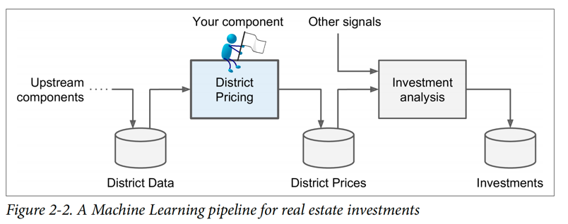
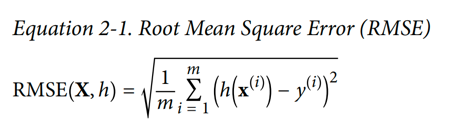
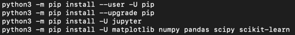
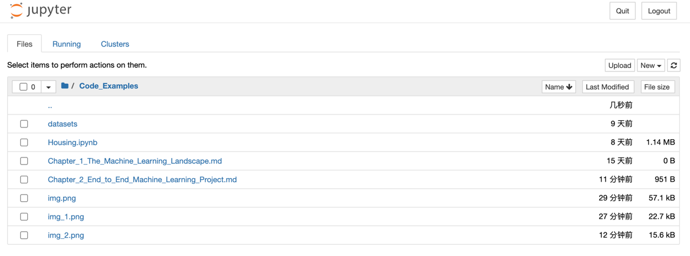

# 1. Look at the picture

## 1.1 Frame the Problem

## 1.2 Select a Performance Measure

- Root Mean Square Error (RMSE)

## 1.3 Check the Assumptions

# 2. Get the Data

## 2.1 Create the Workspace

`python3 -m notebook` (for macbook)

## 2.2 Download the Data

- urllib
- pandas

## 2.3 Create a Test Set

- numpy

# 3. Discover and visualize the data to gain insights

## 3.1 Visualizing Geographical Data

## 3.2 Looking for Correlations

## 3.3 Experimenting with Attribute Combinations

# 4. Prepare the Data for Machine Learning Algorithms

- This will allow you to reproduce these transformations easily on any dataset.
- You will gradually build a library of transformation functions that you can reuse in future projects.
- You can use these functions in your live system to transform the new data before feeding it to your algorithms.
- This will make it possible for you to easily try various transformations and see which combination of transformations works best.

## 4.1 Data Cleaning

- Get rid of the corresponding districts.
- Get rid of the whole attribute.
- Set the values to some value (zero, the mean, the median, etc.).

## 4.2 Handling Text and Categorical Attributes

## 4.3 Custom Transformers

## 4.4 Feature Scaling

## 4.5 Transformation Pipelines

# 5. Select a model and train it

## 5.1 Training and Evaluating on the Training Set

- `LinearRegression()`
- `DecisionTreeRegressor()`

## 5.2 Better Evaluation Using Cross-Validation

- Scikit-Learn's K-fold cross-validation feature

# 6. Fine-Tune Your Model

- Grid Search / Randomized Search(for large search space)
- Ensemble Methods

## 6.1 Analyze the Best Models and Their Errors

## 6.2 Evaluate Your System on the Test Set

# 7. Present your solution

# 8. Launch, monitor, and maintain your system